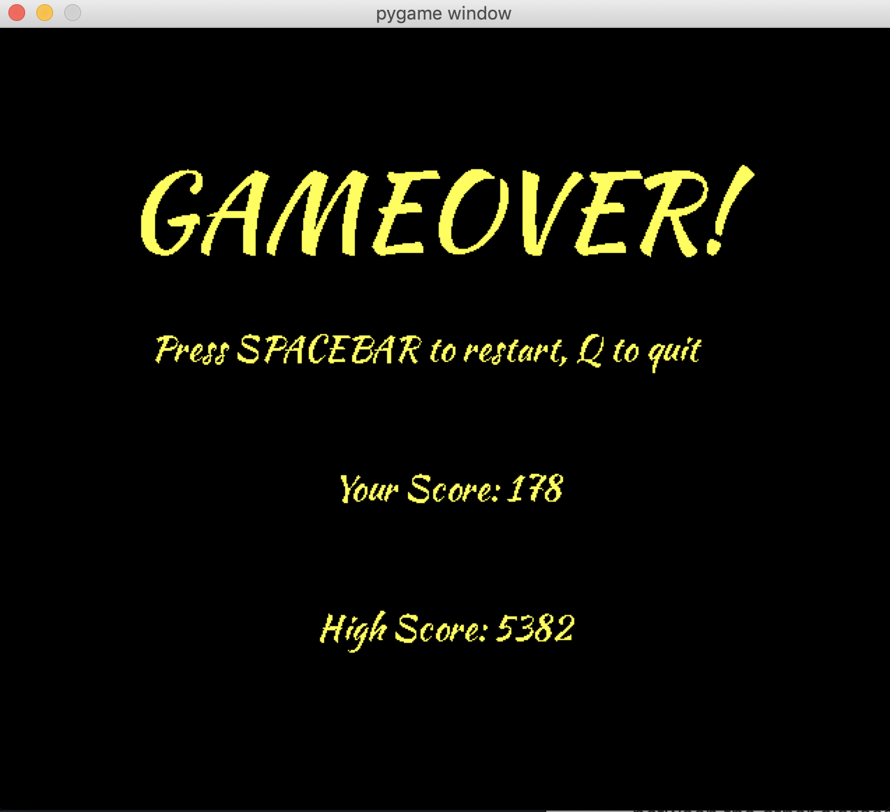

# PacXon
## CS 110 Final Project
### Semester 1, 2018

[https://github.com/binghamtonuniversity-cs110/final-project-fall18-pac-men](https://github.com/binghamtonuniversity-cs110/final-project-fall18-pac-men#)

[Demo presentation slides](https://docs.google.com/presentation/d/1G7f8ov1f7VuE9PrF5XpCShTMaeZksZFAauSIpVwwtRo/edit?usp=sharing)

### Team:
#### Adiel Felsen, Matt Damiata, Jack Stanley

***

## Project Description
PacXon is a game where a player controls a Pacman character to fence portions of the screen. The challenge is that the Pacman has to avoid ghosts who are bouncing around the screen. If the Pacman hits into a ghost, he loses a life. The game is over when Pacman runs out of lives or fences in a certain percentage of the screen. There are many levels with a different number of ghosts and even ghosts with special abilities to make the game more challenging. Pacman can also collect powerups of his own to help him succeed. PacXon uses Pacman’s original characters – Pacman and ghosts – but it is entirely a unique game of its own.

***    

## User Interface Design
1.	Start Screen

   This screen is the first screen that the user sees. It gives the user the option to press SPACEBAR to start the game, "i" to see instructions or "q" to quit.

2.	Instructions Screen

   Explains briefly the goal of the game and the abilities of the different powerups. It gives the user the option to press SPACEBAR to return to the Start Screen or "q" to quit.

3.	The Game Menu

   This is the screen where the gameplay of PacXon takes place. Ghosts bounce around the screen, and Powerups randomly spawn. Using the arrow keys, Pacman can fence in certain areas of the screen, adding to his score. At the bottom of the screen, the lives, level, percent, highscore and score are displayed. If Pacman is collided with, he loses a life. If 80% of the screen is fenced in, the "Next Level Screen" is shown. Pacman gains two lives, gets 250 points and the screen resets with more ghosts. If Pacman has zero lives, the "Game Over Screen" shows. The game is fully reset. If the window is closed or "q" is pressed, the game is closed.

4.	Next Level Screen

   This screen appears if 80% of the screen is filled by Pacman. The screen displays the level number. It gives the user the option to press SPACEBAR to continue or "q" to quit.

5.	Game Over Screen

   This screen appears if Pacman has zero lives. The screen displays the current score and the high score. This screen gives the user the option to press SPACEBAR to restart or "q" to quit.

 

 
  
 

 

 
 
 

 

 

 
 

 

***        

## Program Design

### Non-Standard Libraries and Modules Used
* **Pygame** (https://pygame.org) - A free and Open Source python programming language library for making multimedia applications like games, developed by Pete Shinners and the pygame community.

### List of Classes
* **Controller** - The class that defines the logic between the other classes. It includes collisions with powerups and the abilities that come with them and the bouncing of the ghosts on the screen. It also includes the logic behind filling in the screen, Pacman's motion and the loss of lives when Pacman's trail is collided with. It includes all of the game screens (Intro, Instructions, Game Menu, Next Level and Game Over). It includes win and lose logic and displays everything to the screen.
* **Pacman** - A class that defines the Pacman which is the character that the player controls. The character moves in any direction and is able to "fence in" portions of the screen.
* **Pinky** - the pink ghost that Pacman needs to avoid. This ghost bounces off the walls of non-fenced in areas of the screen. If Pinky collides with Pacman or one of the fences he is currently drawing, Pacman loses a life.
* **Inky** - the light-blue ghost that Pacman needs to avoid. This ghost bounces off the walls of fenced in areas of the screen. If Inky collides with Pacman, Pacman loses a life.
* **Binky** - the red ghost that Pacman needs to avoid. This ghost bounces off the walls of the non-fenced in areas of the screen and breaks any block it hits into (excluding the borders). If Blinky collides with Pacman or one of the fences he is currently drawing, Pacman loses a life.
* **Clyde** - the orange ghost that Pacman needs to avoid. This ghost moves along the edge of a fenced in area. If Clyde collides with Pacman, Pacman loses a life.
* **Banana** - one of the powerups that Pacman can collide with. Once collided with, Pacman's speed will double for 50 frames.
* **Banana** - one of the powerups that Pacman can collide with. Once collided with, all ghost speed is halved for 50 frames.
* **Snowflake** - one of the powerups that Pacman can collide with. Once collided with, the speed of the ghosts is set to zero for 50 frames.
* **Heart** - one of the powerups that Pacman can collide with. Once collided with, Pacman gets an extra life.
* **Screen** - this class holds the matrix which includes the state of each box on the grid - filled (state = 1), unfilled (state = 0) or in the process of being drawn (state = .5). This class also has methods to fill in areas of the screen not containing a ghost, reset the matrix, track the Pacman (and remove it), get the percent of the screen filled and get the number of boxes last filled.
* **Box** - this class defines each "box" object of the grid background. This class references the matrix in the Screen class for changing the images of the objects.  
* **bottomBar** - this class holds all of the data that is displayed to the user (Lives, Level, Percent, Highscore and Score). A method called data() returns the two lines that are displayed to the user.
***

## Tasks and Responsibilities

### Software Lead - Adiel Felsen

Worked with back end on the creation of some classes. Specifically worked on the fillMatrix functionality of the Screen class. Worked closely with front end specialist on the bouncing of ghosts and Pacman collisions. Added Pacman's animation and changed the scoring system. Also cleaned up much of the code to follow the DRY rule. Generally worked through many issues on the front end and the back end to get the code to work properly and commented much of the code to make it clear to understand.

### Front End Specialist - Matt Damiata

Used pygame to create most of the visual aspects of the game. Created the Start Screen, Instructions Screen, Next Level Screen and Game Over Screen and the display of the Bottombar class. Worked closely with software lead on the bouncing and abilities of the Ghosts and worked on Pacman collisions. Worked on generating ghost objects and implemented the "Heart" powerup. Also generally worked on fixing the code to make it work properly.

### Back End Specialist - Jack Stanley

Worked on creating many of the major classes to be used in the game and wrote docstrings to make each methods' functionality clear. Created Botttombar class which displays relevant information to the user. Worked with Software Lead and Front End on finishing the project and implementing object functionality in the Controller class.

***

## Testing

### Menu Testing

First, we run main.py and make sure that the screen loads and displays the correct message. Next, we press Spacebar and make sure that the game screen loads.

### Game Testing

When the game screen loads after pressing SPACEBAR, we see if all of the ghosts are bouncing around the screen properly. Next, we test movement within the "closed" area of the screen. When we press an arrow key once Pacman should move one box in the arrow's direction. When we hold an arrow key, Pacman should move in the arrow's direction until released. We then test movement in the "open" area. When an arrow key is pressed once, Pacman should move in the direction of the key until a collision with a closed area. If another key is pressed before colliding with the closed area, Pacman should change direction. After testing Pacman's movement, we test to see if all Powerups are working properly by colliding with them and seeing if their effects work as expected.

Next, we check to see if general gameplay is working. While playing, we make sure all ghosts and powerups are spawning and that the ghosts are bouncing correctly. We check to see if Pacman creates a trail behind him when he moves in the open area and that all enclosed areas without ghosts are filled in. We also check to see if Pacman loses a life and resets when a ghost collides with his trail. We press "q" to check if it properly exits the game during gameplay.

We then try to reach win state by filling in 80% of the screen. If we are successful, the NEXT LEVEL screen should display its text properly and pressing SPACEBAR should reset the game at the next level. Lives should increase as well. After this we try to reach fail state by allowing ghosts to collide with trail or letting Pacman collide with his own trail. Lives should decrease by 1 each time. Once lives = 0, the GAME OVER screen should display properly. Pressing SPACEBAR should restart the game.

At the end, we reopen the game and check that pressing "q" quits from the MAIN MENU page.

[**Acceptance Test Procedure**](https://docs.google.com/document/d/1lgC7X2ExiSnqh6Bq9eUpIlHZFUis5iK5NN0aLrTkAso/edit?usp=sharing)
